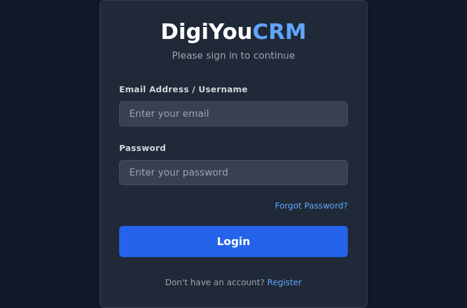
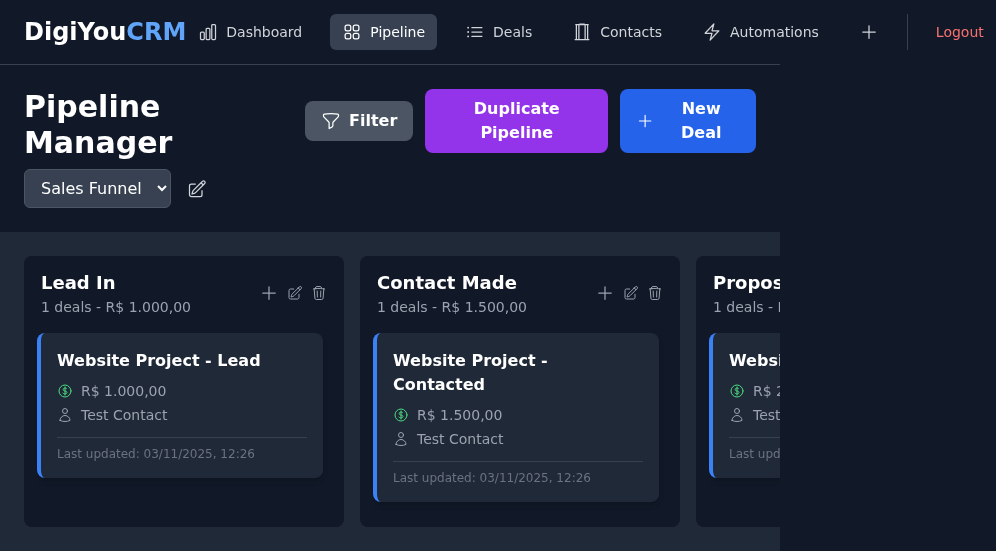
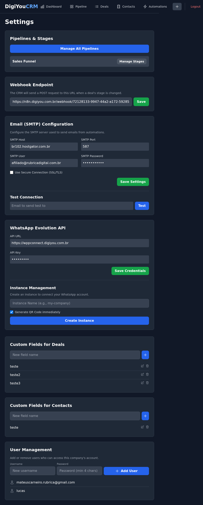

# DigiYou CRM - Pipeline Manager

This project is a modern CRM focused on a Kanban-style pipeline manager, inspired by ActiveCampaign. It allows for comprehensive management of funnels, stages, and deals, with dashboard analytics.

## Key Functionalities

*   **Pipeline Management**: Create and manage sales pipelines with customizable stages.
*   **Deal Tracking**: Track deals through various stages, including value, contact, and status.
*   **Contact Management**: Store and manage contact information, including custom fields and interaction history.
*   **Automation Engine**: Set up automated actions based on deal or task events (e.g., send emails, create tasks, send webhooks, WhatsApp messages).
*   **Email Templates**: Create and manage reusable email templates for automations.
*   **Task Management**: Create and assign tasks, link them to deals or contacts, and track completion.
*   **Calendar Notes**: Schedule and manage important notes and events.
*   **User Management**: Add and remove users with access to the CRM.
*   **Dashboard Analytics**: Visualize key performance indicators and deal distribution.
*   **SMTP Integration**: Configure SMTP settings for sending emails, both system-wide and company-specific.
*   **WhatsApp Integration (Evolution API)**: Connect with WhatsApp for automated messaging.

---

## Running the Application

There are two main ways to run this application: for development and for production.

### Development

For development, you need to run the backend API server and the frontend development server in **two separate terminals**. This allows for features like hot-reloading on the frontend.

**1. Start the Backend Server:**

-   Install dependencies:
    ```bash
    npm install
    ```
-   **Configure Environment Variables**: Create a `.env` file in the project root with the following (replace with your actual SMTP details):
    ```
    # Company-specific SMTP settings (can be overridden per company in CRM settings)
    SMTP_HOST=your_smtp_host
    SMTP_PORT=587
    SMTP_SECURE=false
    SMTP_USER=your_smtp_user
    SMTP_PASS=your_smtp_password

    # System-wide SMTP settings for registration, password reset, etc.
    # These are used for core CRM functionalities and take precedence over SMTP_HOST/PORT/USER/PASS
    SYSTEM_SMTP_HOST=your_system_smtp_host
    SYSTEM_SMTP_PORT=587
    SYSTEM_SMTP_SECURE=false
    SYSTEM_SMTP_USER=your_system_smtp_user
    SYSTEM_SMTP_PASS=your_system_smtp_password

    # Other optional environment variables
    # PORT=4029
    # DB_FILE=crm.db
    ```
-   Start the API server:
    ```bash
    npm start
    ```
-   The server will start on `http://localhost:4029` and create a `crm.db` file if it doesn't exist. Keep this terminal running.

**2. Start the Frontend Server:**

-   Open a **new terminal** in the same project directory.
-   Install dependencies (if you haven't already):
    ```bash
    npm install
    ```
-   Start the Vite development server:
    ```bash
    npm run dev
    ```
-   Vite will provide a local URL, typically `http://localhost:5173`. Open this URL in your browser.

The default login credentials for the initial seeded company are `ADMIN` / `1234`.

---

### Production Deployment on Linux

For a production environment, you should build the React application into static files and have a single Node.js server that serves both the API and the frontend.

**1. Prerequisites:**

-   A Linux server with Node.js and npm installed.
-   Git (for cloning the repository).

**2. Installation:**

-   Clone your project repository to the server.
-   Navigate to the project directory and install all dependencies:
    ```bash
    npm install
    ```

**3. Configuration (Essential for Email Functionality):**

-   **Environment Variables**: Create a `.env` file in the project root with the following (replace with your actual SMTP details):
    ```
    # Company-specific SMTP settings (can be overridden per company in CRM settings)
    SMTP_HOST=your_smtp_host
    SMTP_PORT=587
    SMTP_SECURE=false
    SMTP_USER=your_smtp_user
    SMTP_PASS=your_smtp_password

    # System-wide SMTP settings for registration, password reset, etc.
    # These are used for core CRM functionalities and take precedence over SMTP_HOST/PORT/USER/PASS
    SYSTEM_SMTP_HOST=your_system_smtp_host
    SYSTEM_SMTP_PORT=587
    SYSTEM_SMTP_SECURE=false
    SYSTEM_SMTP_USER=your_system_smtp_user
    SYSTEM_SMTP_PASS=your_system_smtp_password

    # Other optional environment variables
    # PORT=4029
    # DB_FILE=crm.db
    ```
    **Important**: For production, it's highly recommended to set these environment variables directly in your hosting environment (e.g., using `export` commands, a `.env` file managed by your deployment process, or a secrets manager) rather than committing them to version control.

**4. Build the Frontend:**

-   Run the build script to compile the React application into an optimized `dist` folder:
    ```bash
    npm run build
    ```

**5. Start the Production Server:**

-   Run the `start` script. This single command will launch the production-ready server, which serves both your API and the compiled frontend.
    ```bash
    npm start
    ```
-   The application will be accessible at `http://<your-server-ip>:<PORT>`.

**6. Process Management (Recommended):**

-   To ensure your application runs continuously and restarts automatically if it crashes, use a process manager like **PM2**.

-   Install PM2 globally:
    ```bash
    npm install -g pm2
    ```

-   Start your application with PM2:
    ```bash
    pm2 start server.js --name "digiyou-crm"
    ```

-   To make the application start automatically on server reboot, run:
    ```bash
    pm2 startup
    ```
    (This will provide a command you need to copy and run with sudo privileges).

-   Save the current process list to be restored on reboot:
    ```bash
    pm2 save
    ```

-   You can monitor your application with `pm2 list` or `pm2 monit`.

---

## Screenshots

### Login Page



### Pipeline Page



### Settings Page



## Testing SMTP Configuration

### Local Development

1.  **Configure `.env`**: Ensure `SMTP_HOST`, `SMTP_PORT`, `SMTP_SECURE`, `SMTP_USER`, `SMTP_PASS` (for company-specific) and `SYSTEM_SMTP_HOST`, `SYSTEM_SMTP_PORT`, `SYSTEM_SMTP_SECURE`, `SYSTEM_SMTP_USER`, `SYSTEM_SMTP_PASS` (for system-wide) are correctly set in your `.env` file.
2.  **Start Servers**: Run `npm start` (backend) and `npm run dev` (frontend).
3.  **Test System SMTP**:
    *   Navigate to the registration page (`/register`). Try to register a new user. If the system SMTP is configured correctly, you should receive a verification email.
    *   Navigate to the forgot password page (`/forgot-password`). Enter an existing user's email. If configured correctly, you should receive a password reset email.
4.  **Test Company-Specific SMTP**:
    *   Log in to the CRM.
    *   Go to "Settings" -> "Email (SMTP) Configuration".
    *   The fields should be pre-filled from your `.env` `SMTP_` variables. You can modify them here if needed.
    *   Enter a recipient email in the "Test Connection" section and click "Test". You should receive a test email.
    *   Create an automation that sends an email and trigger it to verify.

### Production Environment

1.  **Configure Environment Variables**: Ensure `SYSTEM_SMTP_HOST`, `SYSTEM_SMTP_PORT`, `SYSTEM_SMTP_SECURE`, `SYSTEM_SMTP_USER`, `SYSTEM_SMTP_PASS` and `SMTP_HOST`, `SMTP_PORT`, `SMTP_SECURE`, `SMTP_USER`, `SMTP_PASS` are set in your production environment.
2.  **Deploy and Start**: Follow the "Production Deployment on Linux" steps to build and start your application.
3.  **Test System SMTP**:
    *   Access your deployed CRM's registration page. Register a new user to verify verification email delivery.
    *   Use the forgot password functionality for an existing user to verify password reset email delivery.
4.  **Test Company-Specific SMTP**:
    *   Log in to the deployed CRM.
    *   Navigate to "Settings" -> "Email (SMTP) Configuration".
    *   Verify that the fields reflect the `SMTP_` environment variables set in production.
    *   Send a test email from this section.
    *   Trigger an email automation to confirm it works.